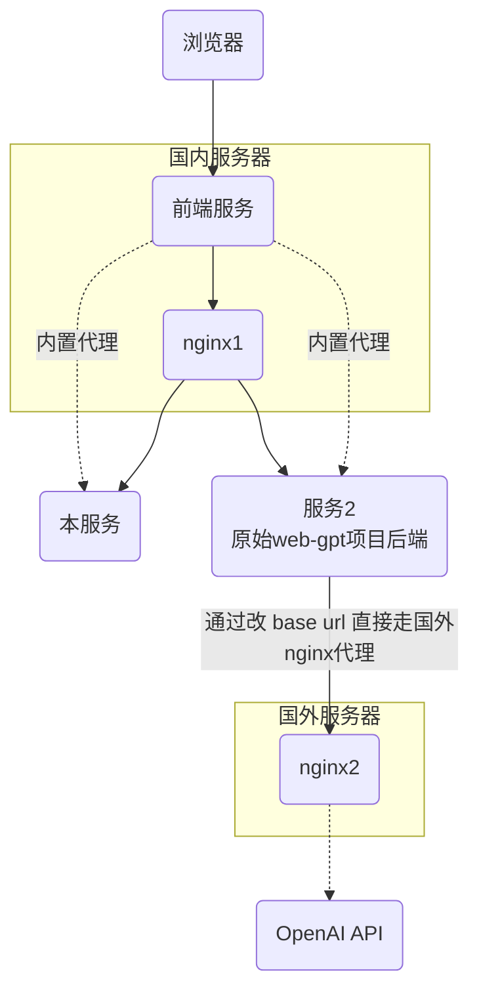

## 项目部署架构

```mermaid
flowchart TB
    browser(浏览器)
    n1(nginx1)
    n2(nginx2)
    bs1(本服务)
    bs2(服务2\n原始web-gpt项目后端)
    openAi(OpenAI API)
    frontend(前端服务)
    
    browser --> frontend
    subgraph a [国内服务器]
        frontend --> n1
    end
    frontend -.内置代理.-> bs1
    n1 --> bs2
    n1 --> bs1
    frontend -.内置代理.-> bs2
    bs2 -- 通过改 base url 直接走国外nginx代理 --> n2
    
    subgraph 国外服务器
        n2
    end
    n2 -.-> openAi
    
    
```

